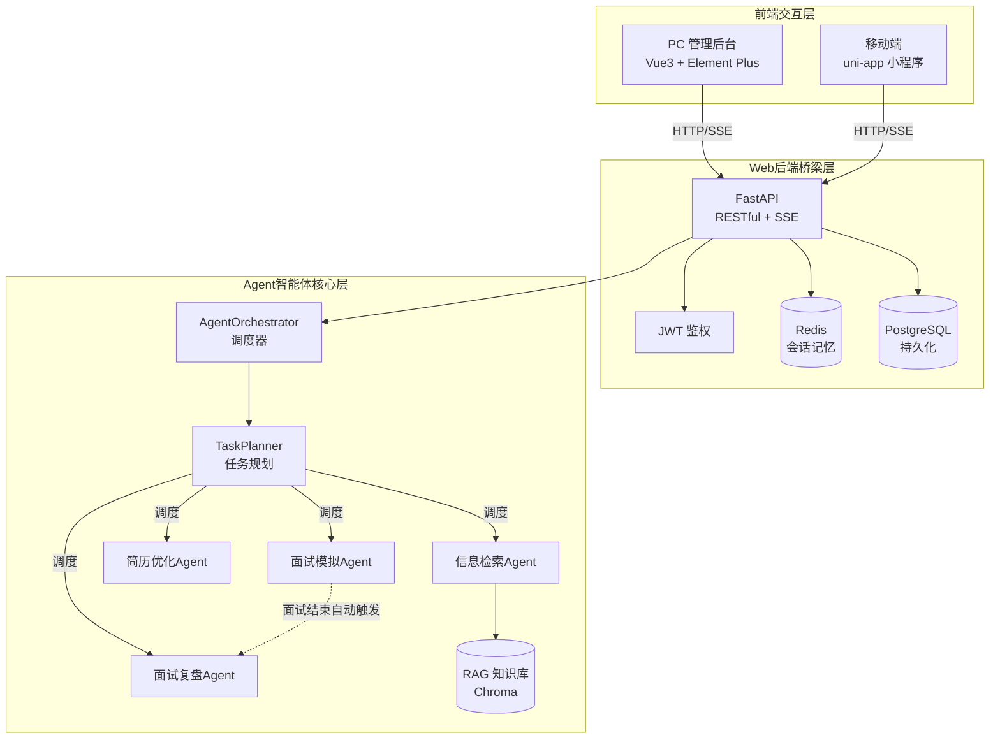

# AI 求职辅助系统

基于 **Plan-Solve 多 Agent 架构** 的求职辅助全栈平台，提供目标公司信息浏览、简历智能优化、结构化面试模拟与多维度复盘功能。

## 架构概览



三层架构说明：

| 层级 | 职责 | 技术栈 |
|------|------|--------|
| Agent 智能体核心层 | 5 类 Agent 协同，Plan-Solve 规划调度 + RAG 检索增强 | Python、OpenAI、ChromaDB |
| Web 后端桥梁层 | 接口服务、鉴权、会话管理、流式输出 | FastAPI、PostgreSQL、Redis、JWT |
| 前端交互层 | 用户交互、数据展示、流式打字机效果 | Vue3、Element Plus、uni-app |

## 目录结构

```
My_program/
├── agent/                          # Agent 智能体核心层
│   ├── orchestrator.py             # 多 Agent 调度器（Plan-Solve 入口）
│   ├── core/
│   │   ├── planner.py              # TaskPlanner 任务规划（意图识别+路由）
│   │   ├── retriever_agent.py      # 信息检索 Agent（RAG）
│   │   ├── resume_agent.py         # 简历优化 Agent
│   │   ├── interview_agent.py      # 面试模拟 Agent
│   │   └── review_agent.py         # 面试复盘 Agent（四维评分）
│   └── knowledge/
│       ├── embeddings.py           # 向量嵌入模型
│       └── vector_store.py         # 向量数据库（Chroma）
│
├── backend/                        # Web 后端桥梁层
│   ├── app/
│   │   ├── main.py                 # FastAPI 应用入口
│   │   ├── config.py               # 配置管理（读取 .env）
│   │   ├── api/                    # 路由层
│   │   │   ├── auth.py             # 认证（注册/登录/me）
│   │   │   ├── companies.py        # 公司信息 CRUD
│   │   │   ├── resume.py           # 简历管理
│   │   │   ├── interview.py        # 面试会话
│   │   │   ├── review.py           # 复盘报告
│   │   │   ├── retrieve.py         # 信息检索
│   │   │   └── agent.py            # Agent 调度接口（SSE 流式）
│   │   ├── services/               # 业务服务层
│   │   ├── models/                 # SQLAlchemy 数据模型
│   │   ├── schemas/                # Pydantic 请求/响应模型
│   │   ├── db/
│   │   │   ├── session.py          # 数据库会话
│   │   │   └── redis_client.py     # Redis 客户端
│   │   └── middleware/
│   │       └── log.py              # 请求日志中间件
│   ├── Dockerfile
│   ├── requirements.txt
│   └── .env                        # 后端本地配置
│
├── frontend/
│   └── pc-admin/                   # PC 管理后台
│       ├── src/
│       │   ├── views/              # 页面
│       │   │   ├── Login.vue       # 登录/注册
│       │   │   ├── CompanyList.vue # 公司列表
│       │   │   ├── CompanyDetail.vue# 公司详情
│       │   │   ├── ResumeOptimize.vue # 简历优化
│       │   │   ├── InterviewSim.vue# 面试模拟（SSE 流式）
│       │   │   ├── Report.vue      # 复盘报告
│       │   │   └── Profile.vue     # 个人中心
│       │   ├── components/          # 通用组件
│       │   ├── api/index.js        # axios 封装
│       │   └── router/index.js     # 路由配置
│       ├── Dockerfile              # 多阶段构建（build + nginx）
│       ├── nginx.conf              # Nginx 配置（SPA + API 代理）
│       └── vite.config.js
│
├── data/                           # 持久化数据
│   ├── chroma_db/                  # 向量数据库
│   └── company_docs/               # 公司文档（RAG 知识源）
│
├── docker-compose.yml              # 容器编排
├── .env                            # 环境变量（本地开发）
├── .env.example                    # 环境变量模板（Docker 部署）
└── README.md
```

## 快速启动

### 方式一：Docker Compose 一键启动（推荐）

**前置条件**：已安装 [Docker Desktop](https://www.docker.com/products/docker-desktop/)

```bash
# 1. 克隆项目后进入根目录
cd My_program

# 2. 复制环境变量模板并修改（按需修改数据库密码、JWT 密钥）
cp .env.example .env

# 3. 一键启动全部服务（PostgreSQL + Redis + 后端 + 前端）
docker compose up -d --build

# 4. 查看启动状态
docker compose ps

# 5. 查看后端日志（确认初始化完成）
docker compose logs -f backend
```

启动完成后访问：

| 服务 | 地址 | 说明 |
|------|------|------|
| PC 管理后台 | http://localhost:3000 | Vue3 前端 |
| 后端 API | http://localhost:8000 | FastAPI 服务 |
| Swagger 文档 | http://localhost:8000/docs | 接口调试 |
| PostgreSQL | localhost:5432 | 数据库 |
| Redis | localhost:6379 | 缓存 |

**停止服务**：
```bash
docker compose down          # 停止并移除容器（保留数据）
docker compose down -v      # 停止并清除数据卷（慎用，会删除数据库数据）
```

### 方式二：本地开发模式（前后端热重载）

适合开发调试，后端代码改动自动重载，前端 HMR 热更新。

**第 1 步：启动 PostgreSQL + Redis（仅启动基础设施容器）**

```bash
docker compose up -d postgres redis
```

**第 2 步：启动后端（uvicorn 热重载）**

```bash
cd backend

# 创建并激活虚拟环境（首次）
python -m venv .venv
# Windows PowerShell
.\.venv\Scripts\Activate.ps1
# Linux/macOS
# source .venv/bin/activate

# 安装依赖（首次）
pip install -r requirements.txt

# 启动后端（--reload 热重载）
uvicorn app.main:app --host 0.0.0.0 --port 8000 --reload
```

**第 3 步：启动前端（Vite HMR）**

```bash
cd frontend/pc-admin

# 安装依赖（首次）
npm install --legacy-peer-deps

# 启动开发服务器（端口 3000，自动代理 /api 到 8000）
npm run dev
```

访问 http://localhost:3000 即可。

## 环境变量说明

根目录 `.env` 用于本地开发（后端直连宿主机暴露的容器端口），
`.env.example` 用于 Docker 部署（容器间通过服务名通信）。

| 变量名 | 本地开发 (.env) | Docker 部署 (.env.example) | 说明 |
|--------|----------------|---------------------------|------|
| DB_HOST | localhost | postgres | 数据库主机 |
| DB_PORT | 5432 | 5432 | 数据库端口 |
| DB_USER | admin | admin | 数据库用户 |
| DB_PASSWORD | your_secure_password | your_secure_password | 数据库密码 |
| DB_NAME | interview_db | interview_db | 数据库名 |
| REDIS_HOST | localhost | redis | Redis 主机 |
| REDIS_PORT | 6379 | 6379 | Redis 端口 |
| LLM_API_KEY | （留空走降级模式） | （填入你的 Key） | OpenAI API Key |
| LLM_BASE_URL | https://api.openai.com/v1 | https://api.openai.com/v1 | LLM 接口地址 |
| LLM_MODEL | gpt-4o | gpt-4o | 模型名称 |
| JWT_SECRET_KEY | dev-secret-change-in-production | change-me-to-a-random-secret | JWT 签名密钥 |
| JWT_EXPIRE_MINUTES | 1440 | 1440 | Token 有效期（分钟） |

> **注意**：Docker 部署时，`DB_HOST` 和 `REDIS_HOST` 在 `docker-compose.yml` 中通过 `environment` 强制覆盖为服务名（postgres / redis），`.env` 中的值不会生效。

## 核心接口

| 方法 | 路径 | 说明 | 鉴权 |
|------|------|------|------|
| POST | /api/auth/register | 用户注册 | 否 |
| POST | /api/auth/login | 用户登录 | 否 |
| GET | /api/auth/me | 获取当前用户 | 是 |
| GET | /api/companies | 公司列表 | 是 |
| GET | /api/companies/{id} | 公司详情 | 是 |
| POST | /api/retrieve/ | 信息检索（RAG） | 是 |
| POST | /api/agent/sync | Agent 同步执行 | 是 |
| POST | /api/agent/stream | Agent SSE 流式执行 | 是 |
| GET | /api/agent/sessions | 会话列表 | 是 |

完整接口文档：启动后访问 http://localhost:8000/docs

## 常见问题排查

### 1. 前端登录/注册无响应

**原因**：后端服务或数据库容器未启动。

**解决**：
```bash
# 检查容器状态
docker compose ps

# 若 backend 未启动，重启全部服务
docker compose up -d
```

### 2. PostgreSQL 密码认证失败

**原因**：`.env` 中的 `DB_PASSWORD` 与 PostgreSQL 容器初始化密码不一致（首次启动后改密码不会生效）。

**解决**：清除数据卷后重新启动：
```bash
docker compose down -v
# 修改 .env 中的 DB_PASSWORD
docker compose up -d
```

### 3. Agent 功能走降级模式

**原因**：`LLM_API_KEY` 未配置。

**解决**：在 `.env` 中填入有效的 OpenAI API Key 后重启后端。降级模式下任务规划走规则路由，面试/简历优化返回占位提示。

### 4. 端口被占用

```bash
# 查看端口占用
# Windows
netstat -ano | findstr ":8000"
# Linux/macOS
lsof -i :8000

# 修改 .env 中的 BACKEND_PORT 或 docker-compose.yml 中的端口映射
```

### 5. Docker 构建缓慢

**原因**：未配置 `.dockerignore`，构建上下文包含了 `node_modules`、`.venv` 等大目录。

**解决**：确认 `backend/.dockerignore` 和 `frontend/pc-admin/.dockerignore` 存在（项目已内置）。

## 技术栈

**后端**：FastAPI 0.115、SQLAlchemy 2.0 (async)、asyncpg、PyJWT、Redis、sse-starlette

**Agent**：OpenAI SDK 1.50、ChromaDB 0.5（向量检索）、tiktoken

**前端**：Vue 3.5、Vite 5、Element Plus 2.8、Axios、Pinia、ECharts

**基础设施**：Docker、Docker Compose、PostgreSQL 16 (pgvector)、Redis 7、Nginx
