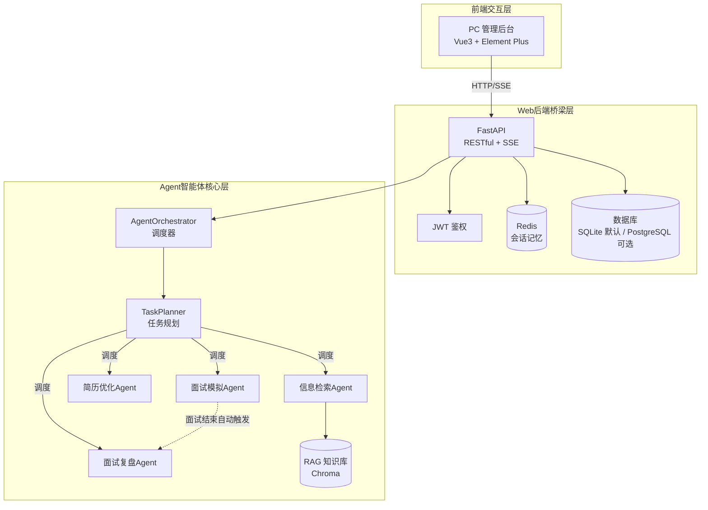

# AI 求职辅助系统

基于 **Plan-Solve 多 Agent 架构** 的求职辅助全栈平台，提供目标公司信息浏览与智能问答、简历智能优化与 ATS 诊断、结构化面试模拟与多维度复盘功能。

## 架构概览



三层架构说明：

| 层级 | 职责 | 技术栈 |
|------|------|--------|
| Agent 智能体核心层 | 5 类 Agent 协同，Plan-Solve 规划调度 + RAG 检索增强 | Python 3.11、OpenAI SDK、ChromaDB |
| Web 后端桥梁层 | 接口服务、鉴权、会话管理、流式输出 | FastAPI、SQLAlchemy 2.0(async)、SQLite/PostgreSQL、Redis、JWT |
| 前端交互层 | 用户交互、数据展示、流式打字机效果 | Vue3、Element Plus、Axios、Pinia、ECharts |

> **数据库说明**：项目默认使用 **SQLite**（零外部依赖，开箱即用）。如需切换为 PostgreSQL（含 pgvector 扩展），将 `.env` 中 `DB_TYPE` 改为 `postgresql` 即可，`docker-compose.yml` 已内置 postgres 服务。

## 目录结构

```
My_program/
├── agent/                          # Agent 智能体核心层
│   ├── orchestrator.py             # 多 Agent 调度器（Plan-Solve 入口 + 文件持久化）
│   ├── core/
│   │   ├── planner.py              # TaskPlanner 任务规划（意图识别 + 路由）
│   │   ├── retriever_agent.py      # 信息检索 Agent（RAG）
│   │   ├── resume_agent.py         # 简历优化 Agent
│   │   ├── interview_agent.py      # 面试模拟 Agent（5 阶段 10 题）
│   │   └── review_agent.py         # 面试复盘 Agent（四维评分）
│   └── knowledge/
│       ├── embeddings.py          # 向量嵌入模型
│       └── vector_store.py         # 向量数据库（Chroma）
│
├── backend/                        # Web 后端桥梁层
│   ├── app/
│   │   ├── main.py                 # FastAPI 应用入口 + lifespan 初始化
│   │   ├── config.py               # 配置管理（读取 .env，DB_TYPE 切换）
│   │   ├── api/                    # 路由层
│   │   │   ├── auth.py             # 认证（注册/登录/me）
│   │   │   ├── companies.py        # 公司信息 CRUD + 智能搜索
│   │   │   ├── resume.py           # 简历管理 + 优化 + 分析
│   │   │   ├── interview.py        # 面试会话（创建/对话/重置/状态恢复）
│   │   │   ├── review.py           # 复盘报告（生成/列表/对话历史/删除）
│   │   │   ├── retrieve.py         # 信息检索（RAG）
│   │   │   ├── retriever.py        # RAG 语义问答 + 向量库管理
│   │   │   └── agent.py            # Agent 调度接口（同步/SSE 流式/会话管理）
│   │   ├── services/               # 业务服务层
│   │   │   ├── agent_service.py
│   │   │   ├── company_service.py
│   │   │   ├── interview_service.py
│   │   │   ├── rag_service.py
│   │   │   ├── resume_service.py
│   │   │   ├── retriever_service.py
│   │   │   └── task_service.py
│   │   ├── models/                 # SQLAlchemy 数据模型（company/interview/resume/user/session/task/message）
│   │   ├── schemas/                # Pydantic 请求/响应模型
│   │   ├── db/
│   │   │   ├── session.py          # 数据库会话（按 DB_TYPE 自动切换 SQLite/PostgreSQL）
│   │   │   ├── redis_client.py     # Redis 客户端
│   │   │   └── types.py            # 自定义类型
│   │   └── middleware/
│   │       ├── __init__.py
│   │       └── log.py              # 请求日志中间件
│   ├── data/                       # 后端运行时数据
│   │   ├── chroma_db/              # 向量数据库持久化
│   │   ├── app.db                  # SQLite 数据库文件
│   │   └── companies.json          # 公司兜底数据
│   ├── Dockerfile
│   ├── requirements.txt
│   └── .env                        # 后端本地配置
│
├── frontend/
│   └── pc-admin/                   # PC 管理后台
│       ├── src/
│       │   ├── views/              # 页面
│       │   │   ├── Login.vue       # 登录/注册
│       │   │   ├── CompanyList.vue # 公司列表
│       │   │   ├── CompanyDetail.vue# 公司详情 + 智能问答
│       │   │   ├── ResumeOptimize.vue # 简历优化
│       │   │   ├── InterviewSim.vue# 面试模拟（SSE 流式）
│       │   │   ├── Report.vue      # 复盘报告
│       │   │   ├── Profile.vue     # 个人中心
│       │   │   └── UserManage.vue  # 用户管理（仅管理员）
│       │   ├── components/ChatDialog.vue # 通用对话组件
│       │   ├── api/index.js        # axios 封装与接口定义
│       │   ├── utils/request.js    # axios 实例（token 注入 + 401 拦截）
│       │   ├── router/index.js     # 路由配置（含角色守卫）
│       │   ├── App.vue
│       │   └── main.js
│       ├── public/data/            # 前端静态数据兜底
│       │   ├── companies.json
│       │   └── users.json
│       ├── dist/                   # 构建产物（Docker 镜像内使用）
│       ├── Dockerfile              # 多阶段构建（node build + nginx）
│       ├── nginx.conf              # Nginx 配置（SPA + /api 代理 + SSE 支持）
│       ├── vite.config.js
│       ├── .env.example
│       └── package.json
│
├── tests/                          # 测试用例
│   ├── test_dual_call_architecture.py  # 面试双调用架构测试
│   ├── test_interview_fix.py
│   └── test_rag_upgrade.py
│
├── docs/                           # 文档目录
│   ├── architecture.md
│   ├── deployment.md
│   └── development.md
│
├── data/                           # 根级持久化数据（SQLite + 向量库）
│   ├── chroma_db/
│   └── app.db
│
├── docker-compose.yml              # 容器编排（backend + pc-admin + redis + postgres）
├── .env                            # 环境变量（本地开发，默认 SQLite）
├── .env.example                    # 环境变量模板（Docker 部署）
├── companies.md                    # 公司数据说明
├── users.md                        # 用户数据说明
└── README.md
```

## 快速启动

### 环境前置要求

- **Python 3.11.x**（必须，3.14 与 chromadb/asyncpg 等依赖不兼容）
- **Node.js 20+**（前端构建）
- **Docker Desktop**（用于启动 Redis / PostgreSQL 容器）

### 方式一：Docker Compose 一键启动（推荐）

**前置条件**：已安装并启动 [Docker Desktop](https://www.docker.com/products/docker-desktop/)

```bash
# 1. 克隆项目后进入根目录
cd My_program

# 2. 复制环境变量模板并修改（按需修改数据库密码、JWT 密钥、LLM Key）
cp .env.example .env

# 3. 一键启动全部服务（Redis + PostgreSQL + 后端 + 前端）
docker compose up -d --build

# 4. 查看启动状态
docker compose ps

# 5. 查看后端日志（确认初始化完成）
docker compose logs -f backend
```

启动完成后访问：

| 服务 | 地址 | 说明 |
|------|------|------|
| PC 管理后台 | http://localhost:3000 | Vue3 前端（nginx 托管） |
| 后端 API | http://localhost:8000 | FastAPI 服务 |
| Swagger 文档 | http://localhost:8000/docs | 接口调试 |
| 健康检查 | http://localhost:8000/api/health | 服务存活探针 |
| PostgreSQL | localhost:5432 | 数据库（可选，默认走 SQLite） |
| Redis | localhost:6379 | 会话记忆 |

**停止服务**：
```bash
docker compose down          # 停止并移除容器（保留数据）
docker compose down -v      # 停止并清除数据卷（慎用，会删除数据库数据）
```

### 方式二：本地开发模式（前后端热重载）

适合开发调试，后端代码改动自动重载，前端 HMR 热更新。默认使用 SQLite，无需启动 PostgreSQL。

**第 1 步：启动 Redis（仅启动基础设施容器）**

```bash
docker compose up -d redis
# 如需使用 PostgreSQL，再追加：docker compose up -d postgres，并在 .env 中设置 DB_TYPE=postgresql
```

**第 2 步：启动后端（uvicorn 热重载）**

```bash
cd backend

# 创建并激活虚拟环境（首次，必须 Python 3.11）
python -m venv .venv
# Windows PowerShell
.\.venv\Scripts\Activate.ps1
# Linux/macOS
# source .venv/bin/activate

# 安装依赖（首次）
pip install -r requirements.txt

# 启动后端（--reload 热重载）
uvicorn app.main:app --host 0.0.0.0 --port 8000 --reload
```

**第 3 步：启动前端（Vite HMR）**

```bash
cd frontend/pc-admin

# 安装依赖（首次）
npm install --legacy-peer-deps

# 启动开发服务器（端口 3000，自动代理 /api 到 8000）
npm run dev
```

访问 http://localhost:3000 即可。

> **前端改动生效说明**：修改 `.vue` 后本地 `npm run dev` 会热更新；但若以 Docker 方式运行前端，需重新构建镜像才能更新 nginx 托管的 dist：`docker compose up -d --build pc-admin`。

## 环境变量说明

根目录 `.env` 用于本地开发（默认 SQLite，零外部依赖），
`.env.example` 用于 Docker 部署（容器间通过服务名通信）。

| 变量名 | 本地开发 (.env) | Docker 部署 (.env.example) | 说明 |
|--------|----------------|---------------------------|------|
| DB_TYPE | sqlite | sqlite（默认） | 数据库类型，`postgresql` 切换至 PG |
| SQLITE_DB_PATH | ./data/app.db | ./data/app.db | SQLite 文件路径 |
| DB_HOST | localhost | postgres | PostgreSQL 主机 |
| DB_PORT | 5432 | 5432 | PostgreSQL 端口 |
| DB_USER | admin | admin | PostgreSQL 用户 |
| DB_PASSWORD | your_secure_password | your_secure_password | PostgreSQL 密码 |
| DB_NAME | interview_db | interview_db | PostgreSQL 库名 |
| REDIS_HOST | localhost | redis | Redis 主机 |
| REDIS_PORT | 6379 | 6379 | Redis 端口 |
| REDIS_PASSWORD | （空） | （空） | Redis 密码 |
| LLM_API_KEY | （留空走降级模式） | （填入你的 Key） | LLM API Key |
| LLM_BASE_URL | https://api.openai.com/v1 | https://api.openai.com/v1 | LLM 接口地址（兼容 DeepSeek 等 OpenAI 协议服务） |
| LLM_MODEL | gpt-4o | gpt-4o | 模型名称（如 deepseek-v4-flash） |
| LLM_EMBEDDING_MODEL | text-embedding-3-small | text-embedding-3-small | 嵌入模型 |
| VECTOR_STORE_TYPE | chroma | chroma | 向量库类型 |
| CHROMA_PERSIST_DIR | ./data/chroma_db | /data/chroma_db | 向量库持久化目录 |
| JWT_SECRET_KEY | dev-secret-change-in-production | change-me-to-a-random-secret | JWT 签名密钥 |
| JWT_ALGORITHM | HS256 | HS256 | JWT 算法 |
| JWT_EXPIRE_MINUTES | 1440 | 1440 | Token 有效期（分钟） |
| BACKEND_PORT | 8000 | 8000 | 后端端口 |
| FRONTEND_PORT | 3000 | 3000 | 前端端口 |
| LOG_LEVEL | INFO | INFO | 日志级别 |

> **注意**：Docker 部署时，`DB_HOST` 和 `REDIS_HOST` 在 `docker-compose.yml` 中通过 `environment` 强制覆盖为服务名（postgres / redis），`.env` 中的值不会生效。但 `DB_TYPE` 仍由 `.env` 控制——若希望容器内使用 PostgreSQL，需在 `.env` / `.env.example` 中显式设置 `DB_TYPE=postgresql`。

## 核心接口

完整接口文档：启动后访问 http://localhost:8000/docs

### 认证 / 用户

| 方法 | 路径 | 说明 | 鉴权 |
|------|------|------|------|
| POST | /api/auth/register | 用户注册 | 否 |
| POST | /api/auth/login | 用户登录 | 否 |
| GET | /api/auth/me | 获取当前用户 | 是 |

### 公司信息

| 方法 | 路径 | 说明 | 鉴权 |
|------|------|------|------|
| GET | /api/companies/ | 公司列表 | 是 |
| GET | /api/companies/{id} | 公司详情 | 是 |
| POST | /api/companies/ | 新增公司 | 是 |
| PUT | /api/companies/{id} | 更新公司 | 是 |
| DELETE | /api/companies/{id} | 删除公司 | 是 |
| POST | /api/companies/smart-search | 智能搜索 | 是 |

### 简历

| 方法 | 路径 | 说明 | 鉴权 |
|------|------|------|------|
| GET | /api/resume/ | 简历列表 | 是 |
| GET | /api/resume/{id} | 简历详情 | 是 |
| POST | /api/resume/ | 新增简历 | 是 |
| PUT | /api/resume/{id} | 更新简历 | 是 |
| DELETE | /api/resume/{id} | 删除简历 | 是 |
| POST | /api/resume/optimize | 简历智能优化 | 是 |
| POST | /api/resume/analyze | 简历综合分析 | 是 |

### 面试模拟

| 方法 | 路径 | 说明 | 鉴权 |
|------|------|------|------|
| POST | /api/interview/ | 创建面试会话 | 是 |
| GET | /api/interview/ | 面试列表 | 是 |
| GET | /api/interview/{id} | 面试详情 | 是 |
| POST | /api/interview/{id}/chat | 提交回答（SSE 流式评估） | 是 |
| POST | /api/interview/{id}/command | 下一题/跳过/结束 | 是 |
| GET | /api/interview/{id}/session-state | 会话状态恢复 | 是 |
| POST | /api/interview/{id}/reset | 会话重置 | 是 |

### 面试复盘

| 方法 | 路径 | 说明 | 鉴权 |
|------|------|------|------|
| GET | /api/review/ | 复盘列表（自动过滤已删除） | 是 |
| GET | /api/review/{interview_id} | 复盘报告详情 | 是 |
| POST | /api/review/{interview_id}/generate | 生成/重新生成报告 | 是 |
| GET | /api/review/{interview_id}/conversation | 面试对话历史 | 是 |
| DELETE | /api/review/{interview_id} | 逻辑删除复盘 | 是 |

### 信息检索 / RAG

| 方法 | 路径 | 说明 | 鉴权 |
|------|------|------|------|
| POST | /api/retrieve/ | 信息检索 | 是 |
| POST | /api/retrieve/qa | 问答检索 | 是 |
| POST | /api/retriever/qa | RAG 语义问答 | 是 |
| POST | /api/retriever/vector/init | 向量库初始化 | 是 |
| POST | /api/retriever/vector/sync/{company_id} | 单公司向量同步 | 是 |
| DELETE | /api/retriever/vector/{company_id} | 删除公司向量 | 是 |

### Agent 调度

| 方法 | 路径 | 说明 | 鉴权 |
|------|------|------|------|
| POST | /api/agent/sync | Agent 同步执行 | 是 |
| POST | /api/agent/stream | Agent SSE 流式执行 | 是 |
| GET | /api/agent/sessions | 会话列表 | 是 |
| GET | /api/agent/sessions/{id} | 会话详情 | 是 |
| POST | /api/agent/sessions/{id}/end | 结束会话（面试自动触发复盘） | 是 |
| DELETE | /api/agent/sessions/{id} | 删除会话及关联记录 | 是 |
| GET | /api/agent/health | Agent 调度健康检查 | 否 |

## 常见问题排查

### 1. 前端登录/注册无响应

**原因**：后端服务或 Redis 容器未启动。

**解决**：
```bash
# 检查容器状态
docker compose ps

# 若 backend 未启动，重启全部服务
docker compose up -d
```

### 2. PostgreSQL 密码认证失败

**原因**：`.env` 中的 `DB_PASSWORD` 与 PostgreSQL 容器初始化密码不一致（首次启动后改密码不会生效）。

**解决**：清除数据卷后重新启动：
```bash
docker compose down -v
# 修改 .env 中的 DB_PASSWORD
docker compose up -d
```

> 若使用默认 SQLite 模式，可跳过本节。SQLite 数据文件位于 `data/app.db`，删除该文件即可重置本地数据库。

### 3. Agent 功能走降级模式

**原因**：`LLM_API_KEY` 未配置或填写无效。

**解决**：在 `.env` 中填入有效的 API Key 后重启后端。降级模式下任务规划走规则路由，面试/简历优化返回占位提示。`LLM_BASE_URL` 兼容任何 OpenAI 协议服务（如 DeepSeek `https://api.deepseek.com/v1`，配合 `LLM_MODEL=deepseek-v4-flash`）。

### 4. 端口被占用

```bash
# 查看端口占用
# Windows
netstat -ano | findstr ":8000"
# Linux/macOS
lsof -i :8000

# 修改 .env 中的 BACKEND_PORT 或 docker-compose.yml 中的端口映射
```

### 5. Docker 构建缓慢

**原因**：未配置 `.dockerignore`，构建上下文包含了 `node_modules`、`.venv` 等大目录。

**解决**：确认 `backend/.dockerignore` 和 `frontend/pc-admin/.dockerignore` 存在（项目已内置）。

### 6. 前端改动在 Docker 中未生效

**原因**：仅本地 `npm run build` 而未重建 Docker 镜像，nginx 仍托管旧 dist。

**解决**：重建前端镜像：
```bash
docker compose up -d --build pc-admin
```

### 7. 依赖安装失败（Python 3.14）

**原因**：chromadb、asyncpg 等依赖在 Python 3.14 下无预编译 wheel。

**解决**：强制使用 Python 3.11.x 创建虚拟环境；Docker 镜像已固定 `python:3.11-slim`。

## 技术栈

**后端**：FastAPI 0.115、SQLAlchemy 2.0 (async)、aiosqlite（默认）/ asyncpg（可选）、PyJWT、Redis、sse-starlette、Alembic

**Agent**：OpenAI SDK 1.50（兼容 DeepSeek 等 OpenAI 协议）、ChromaDB 0.5（向量检索）、tiktoken、httpx==0.27.2（锁定版本，避免与 openai 1.50 不兼容）

**前端**：Vue 3.5、Vite 5、Element Plus 2.8、Axios、Pinia、ECharts 6、Vue Router 4

**基础设施**：Docker、Docker Compose、SQLite（默认）/ PostgreSQL 16 + pgvector（可选）、Redis 7、Nginx
